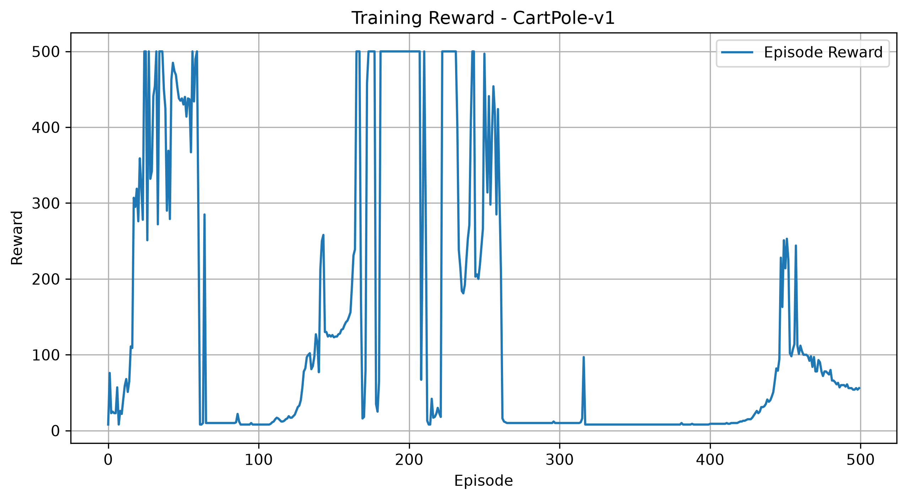
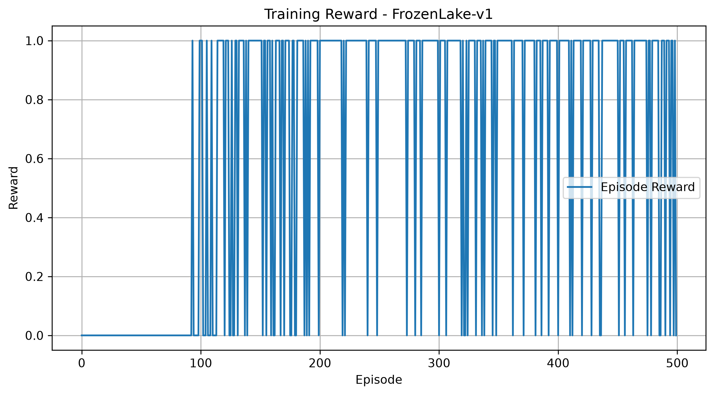

# Reinforcement Learning using Deep Q-Network (DQN)

A Reinforcement Learning project implemented using Deep Q-Network (DQN) in PyTorch. The agent is trained and evaluated on two different Gymnasium environments to demonstrate its ability to learn optimal policies through interaction with the environment.

---

## Task

Create a reinforcement learning algorithm and show the results of it on two widely different problems.

The project demonstrates a Deep Q-Network (DQN) by training and evaluating agents on two different Gymnasium environments:

- CartPole-v1
- FrozenLake-v1

---

## Features

- Deep Q-Network (DQN) implementation
- Experience Replay
- ε-Greedy Exploration Strategy
- Automatic model checkpoint saving
- Training reward visualization
- Model evaluation
- Support for multiple Gymnasium environments
- Jupyter Notebook demonstration
- GPU acceleration (CUDA / Apple Silicon MPS when available)

---

## Project Structure

```
RL-Agent_TwoEnvironments/
│
├── notebooks/
│   └── reinforcement_learning_demo.ipynb
│
├── src/
│   ├── checkpoints/
│   ├── outputs/
│   ├── agent.py
│   ├── config.py
│   ├── dqn.py
│   ├── environment.py
│   ├── evaluate.py
│   ├── replay_buffer.py
│   ├── train.py
│   ├── utils.py
│   └── visualize.py
│
├── requirements.txt
├── README.md
└── .gitignore
```

---

## Environments

### CartPole-v1

The objective is to balance a pole on a moving cart by selecting left or right actions.

### FrozenLake-v1

The agent learns to navigate a slippery grid world while avoiding holes and reaching the goal.

---

## Methodology

The workflow followed in this project is:

```
Environment
      │
      ▼
State Observation
      │
      ▼
Deep Q-Network
      │
      ▼
Action Selection
      │
      ▼
Environment Interaction
      │
      ▼
Experience Replay
      │
      ▼
Network Update
```

---

## Installation

Clone the repository

```bash
git clone https://github.com/yourusername/RL-Agent_TwoEnvironments.git
```

Move into the project directory

```bash
cd RL-Agent_TwoEnvironments
```

Install dependencies

```bash
pip install -r requirements.txt
```

---

## Training

```bash
cd src

python train.py
```

The trained models are automatically saved inside:

```
src/checkpoints/
```

---

## Evaluation

```bash
python evaluate.py
```

The evaluation script loads the trained models and reports the agent's performance on both environments.

---

## Reward Visualization

```bash
python visualize.py
```

Training reward curves are generated inside:

```
src/outputs/
```

---

## Notebook

The notebook

```
notebooks/reinforcement_learning_demo.ipynb
```

demonstrates:

- Project configuration
- Environment information
- Training reward curves
- Model evaluation
- Complete reinforcement learning workflow

---

## Results

### CartPole-v1



---

### FrozenLake-v1



---

## Technologies Used

- Python
- PyTorch
- Gymnasium
- NumPy
- Matplotlib

---

## Hardware Acceleration

The project automatically detects and utilizes the best available computing device.

- Apple Silicon (MPS)
- NVIDIA CUDA
- CPU (fallback)

---

## Future Improvements

- Implement Double DQN
- Implement Dueling DQN
- Add TensorBoard logging
- Support additional Gymnasium environments
- Compare multiple reinforcement learning algorithms

---

## Author

Chetana Ingle

Computer Engineering Graduate

Artificial Intelligence & Machine Learning Enthusiast
